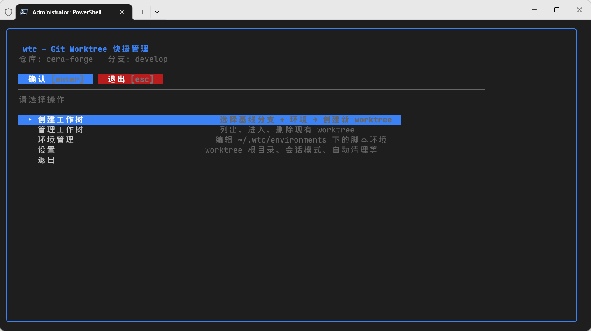

# wtc — Git Worktree 快捷管理 TUI

一个基于 Go + Bubble Tea 的 TUI CLI，让 `git worktree` 从命令行的手动操作，变成一句 `wtc` 走完选基线、执行环境脚本、进入新会话的流畅工作流。

灵感来源于 ChatGPT Codex / Claude Code 桌面端的"新建工作树"面板：为每个正在做的事情起一个独立工作树，配一个可配置的初始化脚本环境。



## 特性

- **一键创建**：在任意 git 仓库下敲 `wtc`，通过 TUI 选基线分支（可先从远程拉取）→ 选环境 → 命名 → 选会话模式 → 完成创建。
- **环境脚本**：`~/.wtc/environments/*.yml` 里定义 `onCreate` / `onSpawned` / `onCleanup`，每个都支持 `default / macos / linux / windows` 四个平台块。
- **会话切换**：三种进入 worktree 的方式：
  - `print` — 打印 `cd` 命令并复制到剪贴板
  - `spawn` — 打开新终端窗口（Windows Terminal / Terminal.app / gnome-terminal 等）
  - `eval` — 输出 shell 片段，配合 wrapper 函数实现"当场切换"
- **管理面板**：TUI 内可列出、进入、删除已有 worktree。
- **`wtc over`**：在 worktree 内一句命令删掉当前工作树（含 kill 占用进程兜底），返回源仓库。
- **鼠标支持**：滚轮滚动列表，点击列表项 + 顶部按钮条 —— 键鼠都能用。
- **跨平台**：Windows、macOS、Linux 一致体验。

## 安装

### 下载预编译二进制

从 [Releases](https://github.com/FxRayHughes/worktreecli/releases) 下载对应平台的可执行文件，放到 `PATH` 里即可。

### 用 `go install`

```bash
go install github.com/FxRayHughes/worktreecli@latest
```

产物在 `$(go env GOPATH)/bin/worktreecli`。可以自行改名为 `wtc`。

### 从源码构建

```bash
git clone https://github.com/FxRayHughes/worktreecli
cd worktreecli
go build -o wtc .
```

## 快速上手

在任意 git 仓库中：

```bash
wtc
```

TUI 主菜单：

```
▸ 创建工作树     选择基线分支 + 环境 → 创建新 worktree
  管理工作树     列出、进入、删除现有 worktree
  环境管理       编辑 ~/.wtc/environments 下的脚本环境
  设置           worktree 根目录、会话模式、自动清理等
  退出
```

创建流程：`选基线 → 选环境 → 命名 → 选会话模式 → 确认 → 完成`。

## CLI 子命令

```bash
wtc              # 进入 TUI
wtc ls           # 列出当前仓库的 worktree
wtc rm <name>    # 删除指定 worktree
wtc over         # 在 worktree 内执行：删除当前 worktree 并返回源仓库
wtc env ls       # 列出所有环境
wtc env path     # 打印环境目录
wtc config show  # 显示当前配置
wtc config path  # 打印配置文件路径
```

## 配置文件

首次运行会生成：

- `~/.wtc/config.yml` — 全局配置（带完整注释）
- `~/.wtc/environments/codegraph.yml` — 示例：初始化 codegraph 索引
- `~/.wtc/environments/noop.yml` — 空环境模板

### 环境 yml 示例

```yaml
name: "CodeGraph 初始化"
description: "在新工作树上初始化 codegraph 索引"

# onCreate: worktree 创建后立即在后台执行
onCreate:
  default: |
    cd "$CODEX_WORKTREE_PATH"
    echo "worktree ready: $CODEX_WORKTREE_PATH"
  windows: |
    Set-Location "$env:CODEX_WORKTREE_PATH"
    codegraph init

# onSpawned: 会话模式为 spawn 时，在新终端窗口内自动执行
onSpawned:
  default: ""
  linux: |
    echo "welcome to $CODEX_WORKTREE_NAME"

# onCleanup: worktree 被删除前执行（可选）
onCleanup:
  default: ""
```

### 环境变量

在环境脚本里可用：

| 变量 | 含义 |
|---|---|
| `CODEX_SOURCE_TREE_PATH` | 原始 git 仓库路径 |
| `CODEX_WORKTREE_PATH` | 新建 worktree 的绝对路径 |
| `CODEX_WORKTREE_NAME` | worktree 名称 |
| `CODEX_BRANCH` | 新建分支名（默认 `wt/<name>`） |
| `CODEX_BASE_BRANCH` | 基线分支名 |

Windows 用 `$env:变量名` 形式。

## 会话模式详解

### print（默认）

```
请在你的终端里执行以下命令进入 worktree：

  cd 'F:/Cache/WorkTree/myproject-a1b2c3'

(已尝试复制到剪贴板)
```

### spawn

自动打开新终端窗口，工作目录设置为 worktree。Windows 优先用 Windows Terminal，回退 cmd；macOS 用 Terminal.app；Linux 依次尝试 gnome-terminal / konsole / xterm 等。

### eval

输出可 `eval` 的 shell 片段，配合下面的 wrapper 函数可在**当前 shell** 中直接切换到 worktree：

```bash
# ~/.bashrc 或 ~/.zshrc
wtc() {
  local out
  out=$(command wtc "$@" --eval) && eval "$out"
}
```

```powershell
# $PROFILE
function wtc {
  if ($args[0] -eq 'over' -or ($args[0] -eq $null)) {
    $script = & 'C:\Users\Administrator\bin\wtc.exe' @args --eval
    Invoke-Expression $script
  } else {
    & 'C:\Users\Administrator\bin\wtc.exe' @args
  }
}
```

## 兼容性

- Windows 10 / 11
- macOS 12+
- Linux（任意主流发行版）
- Go 1.21+（从源码构建时）

## 已知限制

- Windows 上删除 worktree 若遇到文件被占用（IDE / 索引进程等），会尝试 kill 占用进程；若仍失败，会重命名为 `.stale` 让 git 忘掉引用，请稍后手动清理残留目录。
- `eval` 模式必须配合 wrapper 函数，直接调用不会切换 cwd（这是 shell 层限制，任何子进程都改不了父 shell 的 cwd）。

## 开发

```bash
go build ./...       # 构建
go test ./...        # 单元测试
GOOS=darwin GOARCH=arm64 go build -o wtc-darwin-arm64  # 交叉编译
```

## 许可

MIT — 见 [LICENSE](LICENSE)。
